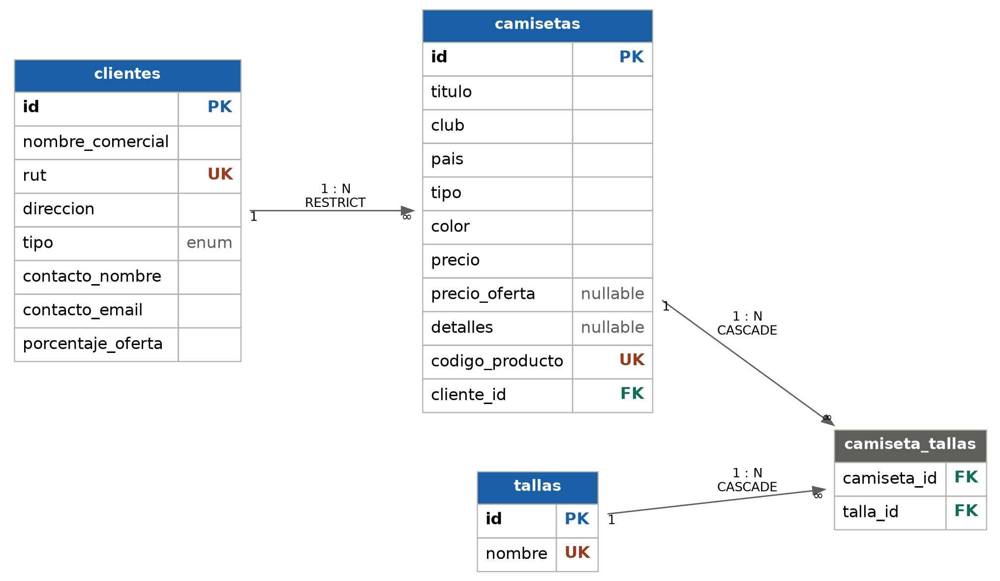

# TodoCamisetas API

API REST para gestión de inventario de camisetas de fútbol y clientes B2B. Desarrollada con Laravel 11, MySQL 8 y Docker.

## Stack Tecnológico

- PHP 8.4 + Laravel 11
- MySQL 8.0
- Docker + Nginx
- Swagger/OpenAPI 3.0 (L5-Swagger)

## Instalación

```bash
# Clonar repositorio
git clone https://github.com/camilomaraya/Examen_Transversal_Backend_2026_Camilo_Merino
cd todocamisetas_eva_transversal/backend

# Copiar variables de entorno
cp .env.example .env

# Levantar contenedores
docker compose up -d --build

# Instalar dependencias
docker compose exec app composer install

# Generar clave
docker compose exec app php artisan key:generate

# Permisos
docker compose exec --user root app chmod -R 777 storage bootstrap/cache

# Ejecutar migraciones
docker compose exec app php artisan migrate

# Cargar datos de prueba
docker compose exec app php artisan db:seed

# Generar documentación Swagger
docker compose exec app php generate-swagger.php
```

## Endpoints

### Health
| Método | Ruta | Descripción |
|--------|------|-------------|
| GET | /api/health | Estado del servicio |

### Camisetas
| Método | Ruta | Descripción |
|--------|------|-------------|
| GET | /api/camisetas | Listar camisetas (filtro opcional: ?cliente_id=) |
| POST | /api/camisetas | Crear camiseta |
| GET | /api/camisetas/{id} | Ver camiseta con precio_final (opcional: ?cliente_id=) |
| PUT | /api/camisetas/{id} | Actualizar camiseta |
| DELETE | /api/camisetas/{id} | Eliminar camiseta |

### Clientes
| Método | Ruta | Descripción |
|--------|------|-------------|
| GET | /api/clientes | Listar clientes |
| POST | /api/clientes | Crear cliente |
| GET | /api/clientes/{id} | Ver cliente con sus camisetas |
| PUT | /api/clientes/{id} | Actualizar cliente |
| DELETE | /api/clientes/{id} | Eliminar cliente (falla si tiene camisetas) |

### Tallas
| Método | Ruta | Descripción |
|--------|------|-------------|
| GET | /api/tallas | Listar tallas |
| POST | /api/tallas | Crear talla |
| GET | /api/tallas/{id} | Ver talla con camisetas asociadas |
| PUT | /api/tallas/{id} | Actualizar talla |
| DELETE | /api/tallas/{id} | Eliminar talla |


## Modelo de Datos




## Lógica de Precio Final

Al consultar `GET /api/camisetas/{id}?cliente_id=X`:
- Si el cliente es **Preferencial** y la camiseta tiene `precio_oferta` definido → `precio_final = precio_oferta`
- En cualquier otro caso → `precio_final = precio` (precio base)

## Documentación Swagger

Con los contenedores corriendo: [http://localhost:8080/api/documentation](http://localhost:8080/api/documentation)

 - Camilo Meriño


Examen Transversal — Desarrollo Backend — Instituto Profesional San Sebastián
